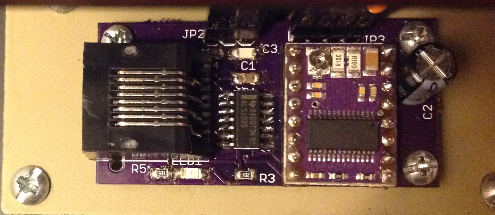

# Driver Module

The driver module is mounted on the derotator that takes signals from
the controller to step the stepper motor. It also sends back an
interrupt signal when the derotator is at its *HOME* position.

## Copyright

The schematic and board designs are copyright 2015 C.Y. Tan and
released under the CERN Open Hardware License v1.2

