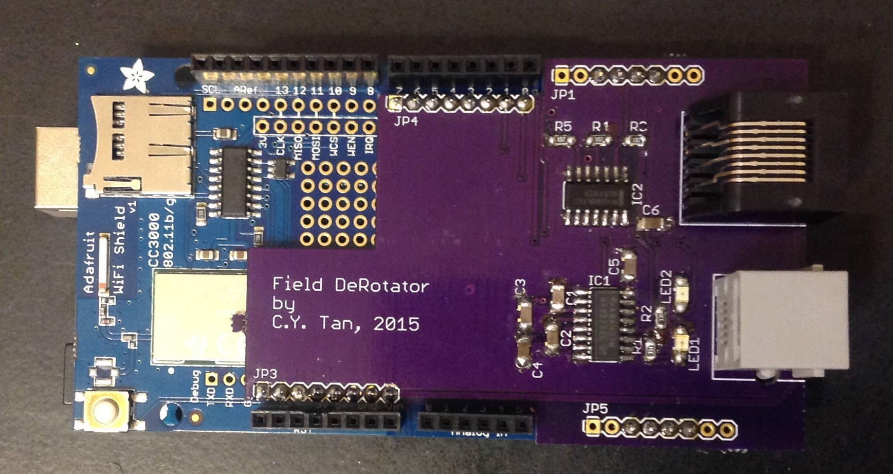

# Field Rotator Controller

This is the module that is installed in the Arduino controller that
acts as the interface between the MEGA2560 and the LX200 and the
driver_module.

## Copyright

The schematic and board designs are copyright 2015 C.Y. Tan and
released under the CERN Open Hardware License v1.2

